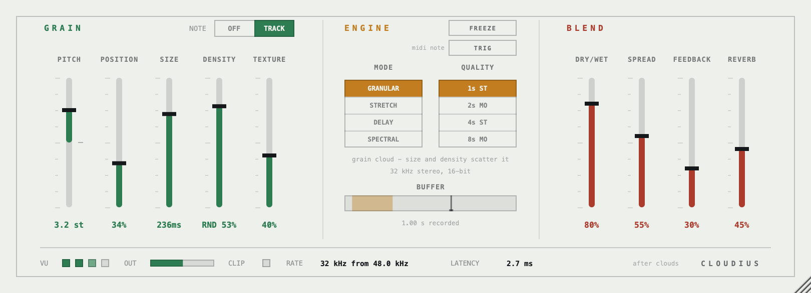
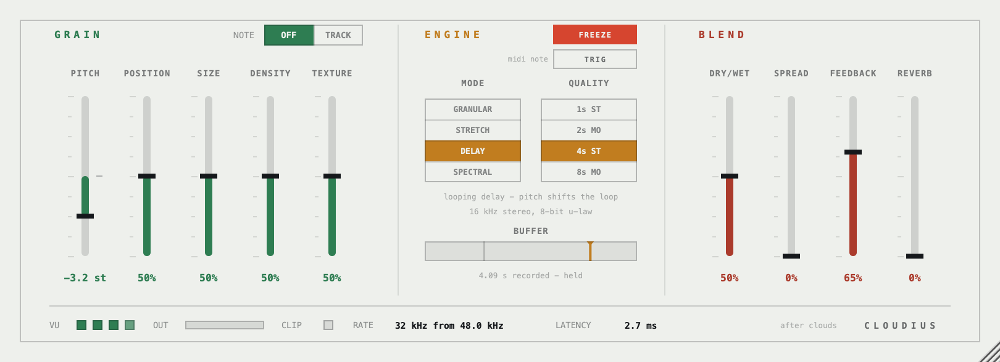

# Cloudius

A VST3 / AU / standalone build of the Mutable Instruments **Clouds** granular
processor, running the module's own firmware DSP rather than a re-implementation
of it.

Everything under `eurorack/` is Émilie Gillet's source, carried over essentially
verbatim — the same files, built with the same `TEST` define the module's own
off-target makefile uses. The plug-in is a shell around it: rate conversion,
parameters, and a panel.

The panel puts **one function on one control**. The hardware hides four values
behind a shared Blend knob and reaches its mode and quality settings through
button holds; here each of those is its own labelled control, always visible,
always doing exactly one thing.

There are no knobs on it. Nine faders in two banks, two four-way lists, two
latches and a switch — 810 x 294, resizable on a fixed aspect. Pitch is a
bipolar fader rather than a different shape, which is what lets every column
start on the same line.



*Granular mode. Frozen looping delay below — the recording head greys out in
the buffer band and Freeze lights.*



## Install

Prebuilt binaries are on the [Releases](https://github.com/SungamMagnus/cloudius/releases)
page. macOS universal (Apple Silicon and Intel), macOS 11 or later — there is
no Windows or Linux build.

Copy the plug-ins where your host looks for them:

```
VST3  ->  ~/Library/Audio/Plug-Ins/VST3/
AU    ->  ~/Library/Audio/Plug-Ins/Components/
```

### Clear the quarantine

These builds carry an ad-hoc signature, not an Apple Developer ID. macOS flags
anything downloaded from the internet as quarantined, and Gatekeeper then
refuses to load the plug-in — usually **silently**, so it simply never appears
in your host and nothing explains why. Run this once after installing:

```sh
xattr -dr com.apple.quarantine ~/Library/Audio/Plug-Ins/VST3/Cloudius.vst3
xattr -dr com.apple.quarantine ~/Library/Audio/Plug-Ins/Components/Cloudius.component
```

Then restart your host and rescan.

Building from source avoids this altogether — a plug-in you compile yourself is
never quarantined.

## Build

Needs CMake ≥ 3.22 and a JUCE checkout (defaults to `/Applications/JUCE`).

```bash
cmake -S . -B build -DCMAKE_BUILD_TYPE=Release && cmake --build build --config Release -j8
```

VST3, AU and a standalone app are copied into the user plug-in folders after a
successful build. On macOS the result is a universal `arm64;x86_64` binary —
`CMAKE_OSX_ARCHITECTURES` is pinned in `CMakeLists.txt`, because an x86_64 CMake
(Homebrew under Rosetta) would otherwise emit an Intel-only plug-in that native
hosts silently skip, with no error to explain it. Worth checking after any build:

```bash
lipo -archs ~/Library/Audio/Plug-Ins/VST3/Cloudius.vst3/Contents/MacOS/Cloudius
```

It must print `x86_64 arm64`.

To look at the faceplate without loading a host:

```bash
cmake -S . -B build -DCLOUDIUS_PANEL_SHOT=ON && cmake --build build --target panel_shot --config Release
```

## Controls

**Grain** — the five pots on the module's left half, as one fader bank.

| Control | Range | Notes |
| --- | --- | --- |
| Pitch | ±2 octaves | The pot's own taper: a quarter turn off noon is three semitones, the ends reach ±24. Reads out in semitones. |
| Note | Off / Track | The module's V/Oct jack, minus the jack: a tracked MIDI note adds to Pitch (middle C = unity). The sum is clamped to ±4 octaves, as the firmware clamps it. |
| Position | 0–100 % | How far back from the recording head the grains are read. |
| Size | 32–512 ms | Grain length in Granular mode; the window, loop or warp elsewhere. |
| Density | 0–100 % | Bipolar around noon — regular below, random above, silent across the dead band the firmware leaves in the middle. |
| Texture | 0–100 % | Window shape then diffusion in Granular; a filter in Stretch and Delay; spectral quantisation in Spectral. |

**Engine**

| Control | Notes |
| --- | --- |
| Mode | Granular / Stretch / Delay / Spectral. |
| Quality | 1 s stereo 16-bit, 2 s mono 16-bit, 4 s stereo 8-bit µ-law, 8 s mono 8-bit µ-law. Buffer lengths are the module's, byte for byte. |
| Freeze | Latches. Stops the recording head. |
| Trig | Fires a grain, or re-aligns the loop. MIDI note-on does the same; a held note holds the gate. |
| Buffer | Display only — amber is where grains are read, ink is the recording head. |

**Blend** — the four values behind the module's Blend knob, one fader each:
Dry/Wet, Stereo Spread, Feedback, Reverb.

## How the host reaches 32 kHz

The module is a 32 kHz machine and nothing else, so each block crosses a rate
boundary twice through a Kaiser-windowed sinc (64 taps, ~-80 dB stopband). The
cut-off lands at 14.4 kHz either way, which is roughly where the module's own
codec gives up — measured flat to 12 kHz, -40 dB at 15 kHz, nothing at all
above 16 kHz. Internally the DSP is fed exactly 32 frames at a time and the
float block is clipped and quantised to the 16-bit codec word first, because
all three of those are part of what Clouds sounds like.

Latency is measured rather than estimated: `prepare()` bypasses the granular
core, sends an impulse through the whole chain and reports where it lands —
129 samples (2.7 ms) at 48 kHz. It is reported to the host, so a DAW compensates.

## Deviations

Three, all deliberate:

1. **`Window::Start()` clears `done_` and `half_`** (`eurorack/clouds/dsp/window.h`).
   Upstream leaves them alone, and `OverlapAdd()` returns early while `done_` is
   set — which `Init()` sets and nothing else clears. Built off-target the WSOLA
   engine therefore never emits its first window and **Stretch mode stays silent
   for good**; with the two lines added it produces a stable signal at the
   expected level. A window that has just been started is by definition not
   finished. This is the only edit to a firmware source file.

2. **Output trim of ×2√2** (`Source/CloudsEngine.cpp`). Codec word in, codec
   word out, the firmware runs 9.4 dB down: the blend LUT tops out at 1/√2 and
   `SoftConvert()` halves again on the way to the DAC, so fully dry leaves the
   DSP at 0.35. Undoing exactly those two factors — *after* the conversion, so
   the internal clip point does not move — puts a fully dry setting at unity,
   measured at −0.3 dB flat to 12 kHz.

   The side effect is that the module's headroom now sits above 0 dBFS instead
   of below it: the wet path carries its own +1.6 dB post-gain and can reach
   +9 dB before the firmware's soft limiter — which is the point where the
   module itself would be running hot. Watch the meters on dense granular
   settings. Set the constant to `1.0f` for the raw fixed-point staging.

3. **`Prepare()` runs once per 32-frame block.** On the module it runs in the
   main loop while `Process()` fires from the codec interrupt. There is one
   thread here, so the correlator search that Stretch mode leans on gets fewer
   passes per block than the hardware gives it.

Not deviations, just absent: calibration, the four flash sample memories, and
the factory test mode — all of them hardware.

## Licence

MIT. The DSP is Émilie Gillet's; see `LICENSE`. Cloudius is not a Mutable
Instruments product and is not affiliated with or endorsed by them.
